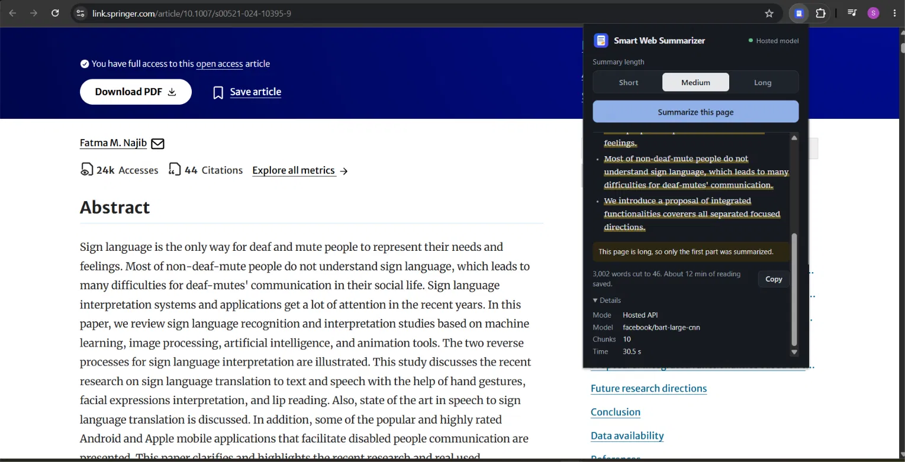
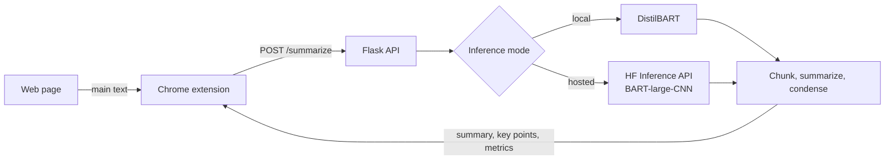

# Smart Web Summarizer

A Chrome extension that summarizes the web page you're reading in one click. It extracts the page's main text, sends it to a Flask backend, and returns a short summary with key points using HuggingFace summarization models, either running on your machine or through the hosted Hugging Face Inference API.



## Features

- **One-click summaries** of the current page, with short, medium, and long length options
- **Handles long pages** with hierarchical summarization: the text is split into overlapping chunks, each chunk is summarized, and the results are condensed into a final summary
- **Two inference modes**: run DistilBART locally, or use BART-large-CNN through the Hugging Face Inference API with no model download
- **Resilient hosted mode** with timeouts, retries, and an adaptive fallback that trims input when the model rejects long text
- **Backend status in the popup**, showing whether the backend is online and which mode is active
- **Reading time saved**, word counts, chunk count, model, and processing time for every summary
- **Clean output**: citation markers like `[19]` are removed and model spacing quirks are fixed
- **Copy button**, remembered length preference, light and dark themes, and a keyboard shortcut (`Ctrl+Shift+Y`)

## How it works



1. The extension picks the largest `article` or `main` block on the page (falling back to the full page) and sends up to 50,000 characters to the backend.
2. The backend cleans the text and caps it at 20,000 characters. If it was cut, the response includes `truncated: true` and the popup tells the user.
3. Text longer than 2,200 characters is split into overlapping chunks. Each chunk is summarized, the chunk summaries are condensed again if still too long, and a final pass produces the summary.

## Tech stack

| Part | Tools |
|---|---|
| Extension | JavaScript, Chrome Extension API (Manifest V3), HTML, CSS |
| Backend | Python, Flask, Flask-CORS, python-dotenv |
| Models | HuggingFace Transformers, DistilBART (`sshleifer/distilbart-cnn-12-6`), BART-large-CNN (`facebook/bart-large-cnn`) |

## Project structure

```
Smart_Web_Summarizer/
├── backend/
│   ├── app.py              # Flask API: /health and /summarize
│   ├── summarizer.py       # Cleaning, chunking, local and hosted inference
│   ├── requirements.txt
│   └── .env.example        # Configuration template
└── extension/
    ├── manifest.json
    ├── popup.html
    ├── popup.css
    ├── popup.js            # Text extraction, API calls, rendering
    └── icons/
```

## Getting started

### Prerequisites

- Python 3.9+
- Google Chrome
- A [Hugging Face access token](https://huggingface.co/settings/tokens) for hosted mode

### 1. Run the backend

**Windows (PowerShell)**

```powershell
cd backend
python -m venv .venv
.\.venv\Scripts\Activate.ps1
python -m pip install -r requirements.txt
copy .env.example .env
python app.py
```

**macOS / Linux**

```bash
cd backend
python3 -m venv .venv
source .venv/bin/activate
python -m pip install -r requirements.txt
cp .env.example .env
python app.py
```

Open `.env` and add your Hugging Face token. The backend runs at `http://127.0.0.1:5000`. Check it with:

```bash
curl http://127.0.0.1:5000/health
```

### 2. Load the extension

1. Open `chrome://extensions`
2. Turn on **Developer mode**
3. Click **Load unpacked** and select the `extension/` folder

### 3. Summarize a page

Open an article, click the extension icon (or press `Ctrl+Shift+Y`), choose a length, and click **Summarize this page**.

## Configuration

Settings live in `backend/.env`. Restart the backend after changing them.

| Variable | Default | Description |
|---|---|---|
| `USE_HF_INFERENCE_API` | `false` | `true` uses the hosted API, `false` runs the model locally |
| `HF_API_TOKEN` | none | Hugging Face token, required for hosted mode |
| `HF_API_MODEL` | `facebook/bart-large-cnn` | Model used in hosted mode |
| `HF_API_TIMEOUT_SECONDS` | `90` | Request timeout for the hosted API |
| `HF_API_RETRIES_PER_ENDPOINT` | `2` | Retries per endpoint on timeouts or server errors |
| `HF_INFERENCE_URLS` | HF router URL | Optional comma-separated endpoint templates containing `{model}` |
| `LOCAL_MODEL` | `sshleifer/distilbart-cnn-12-6` | Model used in local mode |

### Local vs. hosted mode

| | Local | Hosted |
|---|---|---|
| Model | DistilBART | BART-large-CNN |
| Setup | Downloads about 1.2 GB on first run | Needs a Hugging Face token |
| Speed on a laptop CPU | Slow on long pages | Much faster |
| Privacy | Text stays on your machine | Text is sent to Hugging Face |

In an initial single-page test on a 3,000-word research article (10 chunks, medium length, laptop CPU), hosted mode took **30.5 s** and local mode took **501.3 s**. A multi-article quality and latency evaluation is planned.

To store downloaded models on another drive, set `HF_HOME` before starting the backend:

```powershell
$env:HF_HOME="D:\hf-cache"
python app.py
```

## API reference

### `GET /health`

```json
{ "ok": true, "mode": "hosted" }
```

### `POST /summarize`

**Request**

```json
{ "text": "Full page text...", "length": "medium" }
```

`length` is `short`, `medium`, or `long`.

**Response**

```json
{
  "summary": "Short summary of the page.",
  "bullets": ["Key point one.", "Key point two."],
  "source_word_count": 3002,
  "summary_word_count": 46,
  "chunk_count": 10,
  "processing_ms": 30500,
  "mode": "hosted",
  "model": "facebook/bart-large-cnn",
  "truncated": true
}
```

Invalid input returns `400` with an `error` message.

## Troubleshooting

| Problem | Fix |
|---|---|
| Popup shows "Backend offline" | Start the backend with `python app.py`, then reopen the popup |
| `ModuleNotFoundError` | Activate the virtual environment and run `python -m pip install -r requirements.txt` |
| `Fatal error in launcher` after moving the folder | Delete `.venv` and create it again |
| PowerShell blocks activation | Run `Set-ExecutionPolicy -Scope CurrentUser RemoteSigned` |
| "PDF files aren't supported yet" | Open the HTML version of the article |
| First local summary is very slow | The model is downloading and loading; later requests are faster |

## Limitations

- Runs against a local backend (`127.0.0.1`), so the backend must be running on the same machine
- PDFs and browser pages such as `chrome://` can't be summarized
- Long pages are cut at 20,000 characters, so later sections may be missed
- Key points are currently sentences taken from the summary
- Both models are trained on news articles and may lean on a page's opening sentences

## Future work

- Evaluate both models with ROUGE and latency on a benchmark dataset
- Generate key points independently from the summary
- PDF support
- Summarize selected text from the right-click menu
- Cache summaries for repeat visits
- Deploy the backend so no local setup is needed